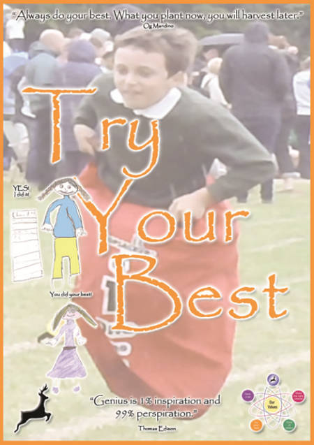
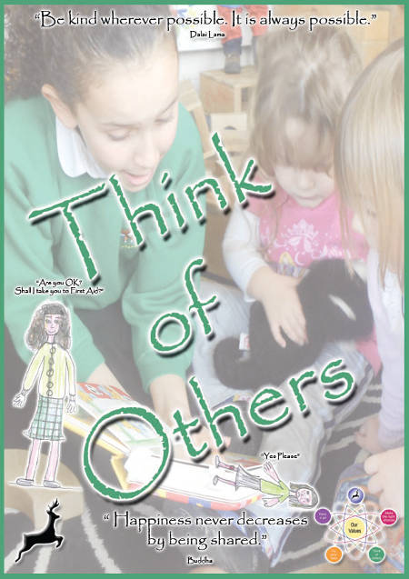

	<h1><em>Inspiring Positive Futures</em></h1>

## Ethos

Decoy Community Primary School actively encourages its children to become caring, hardworking, creative and interesting citizens of the future. Pupils are supported to develop respect for each other and positive relationships.

## Aims

At Decoy Community Primary School, we aim to:

- Provide a happy and stimulating learning environment which promotes curiosity, creativity, enjoyment and interest in all aspects of learning.
- Provide high quality education suitable for the needs of each child using a wide range of teaching methods and experiences.
- Ensure all members of the school staff are confident in their respective roles, working together as a team, co-ordinated by effective leadership.
- Provide a personal and social education which will encourage children to become independent, confident, self-disciplined and courteous.
- Create a school environment which is welcoming, visually inviting, and which is safe and secure for all members of the school community.

## Values

At Decoy Community Primary School our four values enable the children to become effective members of the school community.  
Our values are embedded in our school environment in addition to our teaching and learning to ensure that they are at the forefront of what we do.  
As well as supporting our children with how they relate to others, our values also enable our children to become better learners. Children are taught that the purpose of our values is to support them to achieve in school and also in life.  
Our four values are merely headlines for a wide range of Learning to Learn skills. These skills are taught discretely and referred to regularly and explicitly so that over time the children develop a deeper understanding of the skills they need to learn in relation to the four values. These skills are referred to as the key skills.  
Our values are embedded into our curriculum; key skills are taught discretely in planned activities such as the PSHE curriculum. Additionally, they are woven into all lessons as teachers employ a ‘split screen’ approach to teaching – enabling them to focus on developing the knowledge and understanding of the learner with the key skills developed alongside. Explicit reference to our values and key skills are used across the school, for example when praising children, behaviour sanctions, rewards and reports to parents.  
These key skills can be found in the staff area – Learning to Learn – Key Skills ‘Skills Progression’. A summary of the key skills is shown below:

- Try your best.
- Think of others.
- Make the right choices.
- Have a go.

## Golden Rule

Our Golden Rule is easy: **Treat other people as you would like them to treat you.**
It's as easy as that!

## Behaviour

It is a primary aim of our school that every member of the school community feels valued and respected, and that each person is treated fairly and well. At Decoy School we believe that all children have the right to learn and feel safe and happy at school. We are a caring community, whose values are built on mutual trust and respect for all. We believe in an environment which encourages children and builds self esteem, so that children become more confident, mature independent learners and members of society. The school [behaviour policy][1] is therefore designed to support a structure for managing behaviour within the school that is sensible and understood by all members of the school community.

[1]: https://drive.google.com/open?id=1T9S1LezXR3_Y6Hpu3YeCwt7Hhu_aMssM
